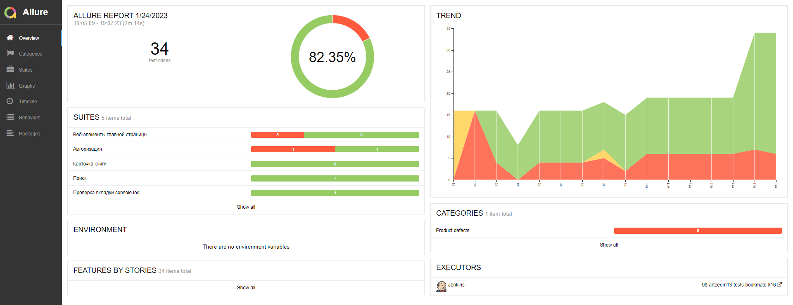
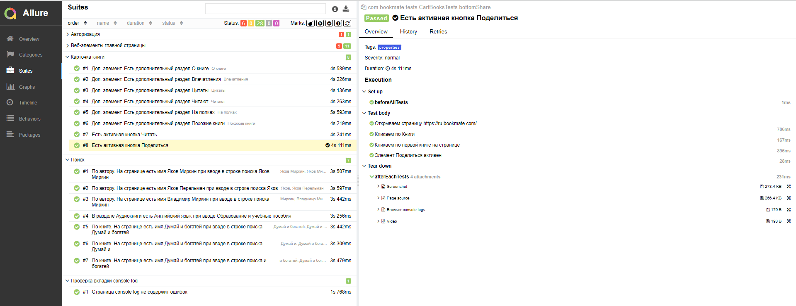

## ***Проект web-автотестирования для bookmate.com выполнен с использованием следующего стека:***
#### :muscle: *Java*
#### :computer: *Junit5*
#### :hammer: *Gradle*
#### :computer: *Selenide*
#### :bar_chart: *Allure Reports, Allure TestOps*
#### :cloud: *Selenoid*
#### :construction_worker: *Jenkins*
#### :iphone: *Telegram*

### :bulb: **Что сделано:**
#### :heavy_check_mark: *Шаги описаны в отельном классе [Steps](https://github.com/arteeem13/bookmate/blob/main/src/test/java/com/bookmate/dataTests/Steps.java)*

#### :heavy_check_mark: *Реализована параметризация тестов*
#### :heavy_check_mark: *Многопоточный запуск*
#### :heavy_check_mark: *Отчетность в Allure*

#### :heavy_check_mark: *Добавлены аттачменты: видео, скриншоты, логи, page source*

#### :heavy_check_mark: *Аттачменты передаются в Allure Reports*

#### :heavy_check_mark: *Настроена инфраструктура для удаленного запуска тестов*

#### :heavy_check_mark: *Гибкий запуск тестов с передачей параметров из Jenkins: выбор браузера, версии*

#### :heavy_check_mark: *Настроена отчетность Allure TestOps*

#### :heavy_check_mark: *Создан телеграмм бот, который сообщает о результатах прогона тестов*

### :bulb: **Реализованные тестовые сценарии для проверки и запланированные:**
#### :heavy_check_mark: *Авторизация*
#### :heavy_check_mark: *Веб-элементы главной страницы*
#### :heavy_check_mark: *Карточка книги*
#### :heavy_check_mark: *Поиск*
#### :heavy_check_mark: *Проверка вкладки console log*
#### :heavy_multiplication_x: *Расширение текущих кейсов*
#### :heavy_multiplication_x: *Локализация и интернационализация*
#### :heavy_multiplication_x: *Подписка*
