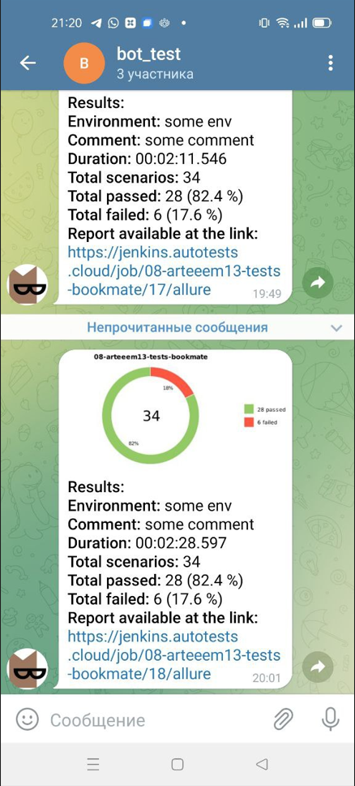

## ***Проект web-автотестирования для bookmate.com выполнен с использованием следующего стека:***
#### :muscle: *Java*
#### :computer: *Junit5*
#### :construction_worker: *Gradle*
#### :computer: *Selenide*
#### :bar_chart: *Allure Reports, Allure TestOps*
#### :cloud: *Selenoid*
#### :construction_worker: *Jenkins*
#### :iphone: *Telegram*

### **Что реализовано:**
#### :heavy_check_mark: *Шаги описаны в отельном классе [Steps](https://github.com/arteeem13/bookmate/blob/main/src/test/java/com/bookmate/dataTests/Steps.java)*

#### :heavy_check_mark: *Реализована параметризация тестов*
#### :heavy_check_mark: *Многопоточный запуск*
#### :heavy_check_mark: *Добавлены аттачменты: видео, скриншоты, логи, page source*
#### :heavy_check_mark: *Аттачменты передаются в Allure Reports*

#### :heavy_check_mark: *Настроена инфраструктура для удаленного запуска тестов*

#### :heavy_check_mark: *Гибкий запуск тестов с передачей параметров из Jenkins*

#### :heavy_check_mark: *Настроена отчетность Allure TestOps*

#### :heavy_check_mark: *Создан телеграмм бот, который сообщает о результатах прогона тестов*
